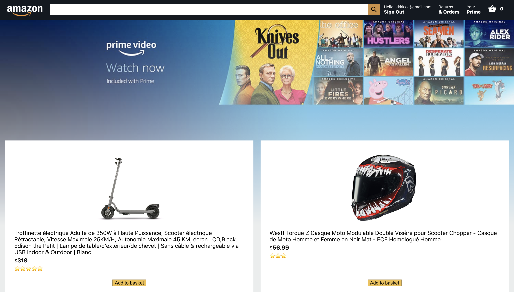
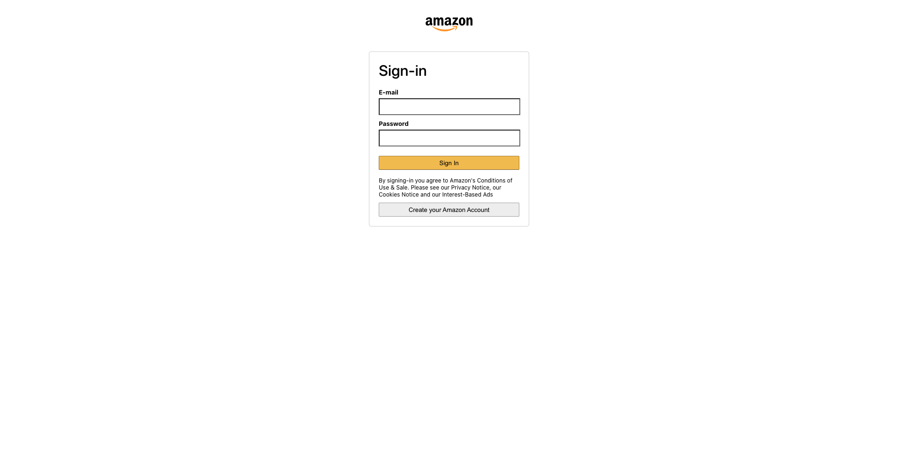
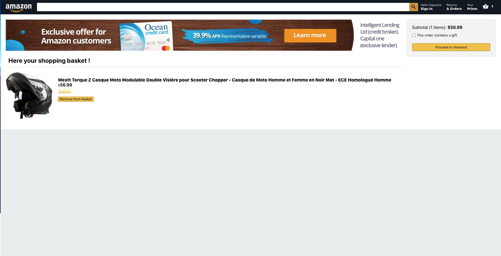
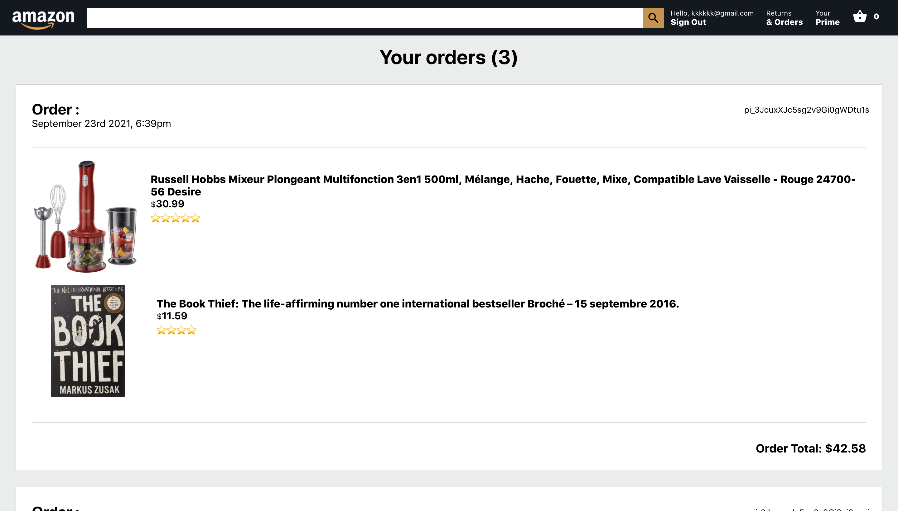
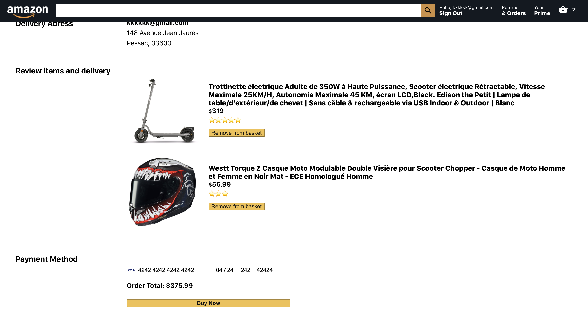

<h1> Amazon Clone 📫 </h1>

I build the full Amazon website in React js hosting on Firebase with full E-Commerce Functionality 👇 

<ul>
  <li>Accounts and Login Page using Firebase Authentication 🙋‍♂️</li>
  <li>Products Page 📦</li>
  <li>Cart and Checkout Page  🛒</li>
  <li>Real Payments using Stripe 💳</li>
  <li>Order History Page in real time databse using Firestore DataBase  📖</li>
</ul>

 
 
<a href="https://clone-e655c.web.app/">Click in to see the app online 🖥️</a>

 

<h1>Home page </h1>

<h1>Sign-in page </h1>

<h1>Basket page </h1>

<h1>Order page </h1>

<h1>Payment page </h1>

